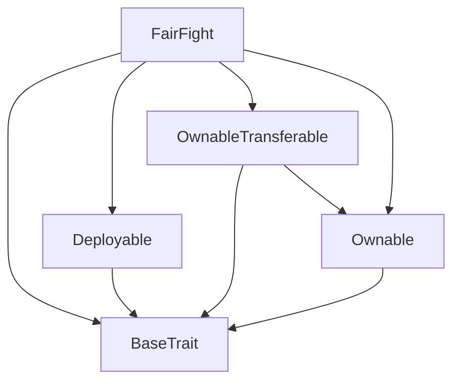
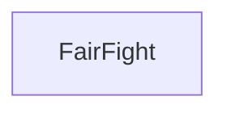

# TACT Compilation Report
Contract: FairFight
BOC Size: 3828 bytes

# Types
Total Types: 22

## StateInit
TLB: `_ code:^cell data:^cell = StateInit`
Signature: `StateInit{code:^cell,data:^cell}`

## Context
TLB: `_ bounced:bool sender:address value:int257 raw:^slice = Context`
Signature: `Context{bounced:bool,sender:address,value:int257,raw:^slice}`

## SendParameters
TLB: `_ bounce:bool to:address value:int257 mode:int257 body:Maybe ^cell code:Maybe ^cell data:Maybe ^cell = SendParameters`
Signature: `SendParameters{bounce:bool,to:address,value:int257,mode:int257,body:Maybe ^cell,code:Maybe ^cell,data:Maybe ^cell}`

## Deploy
TLB: `deploy#946a98b6 queryId:uint64 = Deploy`
Signature: `Deploy{queryId:uint64}`

## DeployOk
TLB: `deploy_ok#aff90f57 queryId:uint64 = DeployOk`
Signature: `DeployOk{queryId:uint64}`

## FactoryDeploy
TLB: `factory_deploy#6d0ff13b queryId:uint64 cashback:address = FactoryDeploy`
Signature: `FactoryDeploy{queryId:uint64,cashback:address}`

## ChangeOwner
TLB: `change_owner#819dbe99 queryId:uint64 newOwner:address = ChangeOwner`
Signature: `ChangeOwner{queryId:uint64,newOwner:address}`

## ChangeOwnerOk
TLB: `change_owner_ok#327b2b4a queryId:uint64 newOwner:address = ChangeOwnerOk`
Signature: `ChangeOwnerOk{queryId:uint64,newOwner:address}`

## FightMsg
TLB: `fight_msg#22fc5b29 amountPerRound:coins rounds:int257 maxPlayersAmount:int257 = FightMsg`
Signature: `FightMsg{amountPerRound:coins,rounds:int257,maxPlayersAmount:int257}`

## Join
TLB: `join#45e011dd id:int257 = Join`
Signature: `Join{id:int257}`

## Withdraw
TLB: `withdraw#1bc3cf3b id:int257 = Withdraw`
Signature: `Withdraw{id:int257}`

## FinishData
TLB: `finish_data#b7766af2 id:int257 address:address contract:address amount:coins = FinishData`
Signature: `FinishData{id:int257,address:address,contract:address,amount:coins}`

## Finish
TLB: `finish#65c269f1 data:FinishData{id:int257,address:address,contract:address,amount:coins} signature:^slice = Finish`
Signature: `Finish{data:FinishData{id:int257,address:address,contract:address,amount:coins},signature:^slice}`

## FightJoin
TLB: `fight_join#78510d7a id:int257 joiner:address = FightJoin`
Signature: `FightJoin{id:int257,joiner:address}`

## ChangeSignerPublicKey
TLB: `change_signer_public_key#f3a6749c signerPublicKey:int257 = ChangeSignerPublicKey`
Signature: `ChangeSignerPublicKey{signerPublicKey:int257}`

## ChangeFee
TLB: `change_fee#0aae7ef0 fee:int257 = ChangeFee`
Signature: `ChangeFee{fee:int257}`

## ChangeFeeCollector
TLB: `change_fee_collector#2b188a82 feeCollector:address = ChangeFeeCollector`
Signature: `ChangeFeeCollector{feeCollector:address}`

## ChangeMaxPlayersAmount
TLB: `change_max_players_amount#d4680bc9 maxPlayers:int257 = ChangeMaxPlayersAmount`
Signature: `ChangeMaxPlayersAmount{maxPlayers:int257}`

## ChangeMaxRoundsAmount
TLB: `change_max_rounds_amount#8c30c157 maxRounds:int257 = ChangeMaxRoundsAmount`
Signature: `ChangeMaxRoundsAmount{maxRounds:int257}`

## ChangeMinAmountPerRound
TLB: `change_min_amount_per_round#dacecab6 minAmountPerRound:int257 = ChangeMinAmountPerRound`
Signature: `ChangeMinAmountPerRound{minAmountPerRound:int257}`

## Fight
TLB: `_ id:int257 owner:address createTime:int257 finishTime:int257 baseAmount:coins amountPerRound:coins rounds:int257 maxPlayersAmount:int257 players:dict<int, address> playersCurrentLength:int257 playersClaimed:dict<address, bool> = Fight`
Signature: `Fight{id:int257,owner:address,createTime:int257,finishTime:int257,baseAmount:coins,amountPerRound:coins,rounds:int257,maxPlayersAmount:int257,players:dict<int, address>,playersCurrentLength:int257,playersClaimed:dict<address, bool>}`

## Fee
TLB: `_ amount:coins fee:coins = Fee`
Signature: `Fee{amount:coins,fee:coins}`

# Get Methods
Total Get Methods: 11

## feeCalc
Argument: baseAmount
Argument: amount

## currentFights

## currentFight
Argument: id

## currentFightPlayers
Argument: id

## currentFightPlayerClaimed
Argument: id
Argument: player

## fee

## maxPlayers

## maxRounds

## minAmountPerRound

## currentPlayerFight
Argument: player

## owner

# Error Codes
2: Stack underflow
3: Stack overflow
4: Integer overflow
5: Integer out of expected range
6: Invalid opcode
7: Type check error
8: Cell overflow
9: Cell underflow
10: Dictionary error
13: Out of gas error
32: Method ID not found
34: Action is invalid or not supported
37: Not enough TON
38: Not enough extra-currencies
128: Null reference exception
129: Invalid serialization prefix
130: Invalid incoming message
131: Constraints error
132: Access denied
133: Contract stopped
134: Invalid argument
135: Code of a contract was not found
136: Invalid address
137: Masterchain support is not enabled for this contract
4109: invalid owner
7757: max amount per round exceeded
13244: value does not equal sum to play
15880: fight has players
31383: player already busy
44463: already claimed
45028: max players amount exceeded
55104: invalid contract address
57400: invalid signature
58632: fight is over
59313: fight is full of players
61308: max rounds amount exceeded

# Trait Inheritance Diagram

# Contract Dependency Diagram

