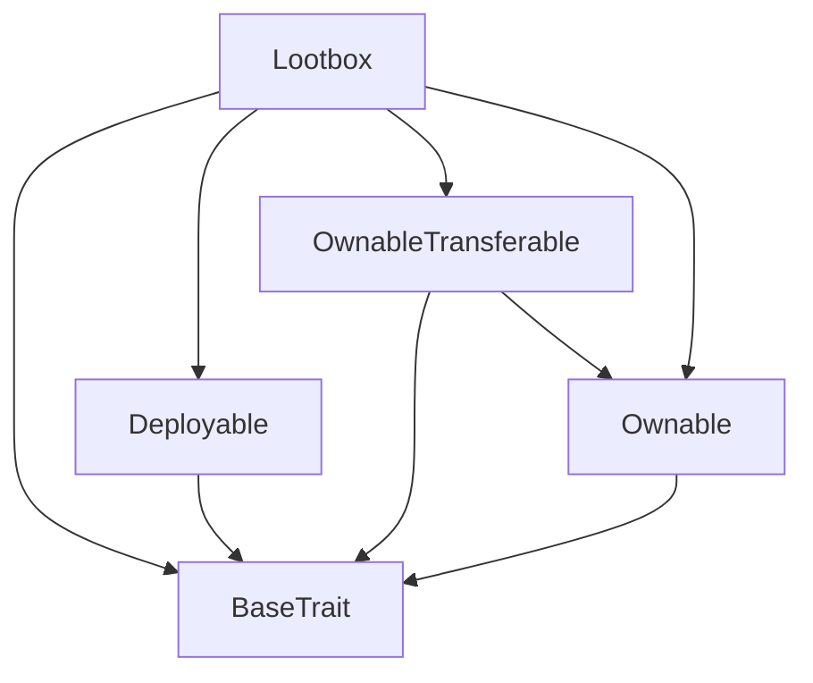
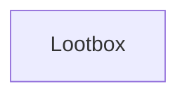

# TACT Compilation Report
Contract: Lootbox
BOC Size: 1876 bytes

# Types
Total Types: 18

## StateInit
TLB: `_ code:^cell data:^cell = StateInit`
Signature: `StateInit{code:^cell,data:^cell}`

## Context
TLB: `_ bounced:bool sender:address value:int257 raw:^slice = Context`
Signature: `Context{bounced:bool,sender:address,value:int257,raw:^slice}`

## SendParameters
TLB: `_ bounce:bool to:address value:int257 mode:int257 body:Maybe ^cell code:Maybe ^cell data:Maybe ^cell = SendParameters`
Signature: `SendParameters{bounce:bool,to:address,value:int257,mode:int257,body:Maybe ^cell,code:Maybe ^cell,data:Maybe ^cell}`

## Deploy
TLB: `deploy#946a98b6 queryId:uint64 = Deploy`
Signature: `Deploy{queryId:uint64}`

## DeployOk
TLB: `deploy_ok#aff90f57 queryId:uint64 = DeployOk`
Signature: `DeployOk{queryId:uint64}`

## FactoryDeploy
TLB: `factory_deploy#6d0ff13b queryId:uint64 cashback:address = FactoryDeploy`
Signature: `FactoryDeploy{queryId:uint64,cashback:address}`

## ChangeOwner
TLB: `change_owner#819dbe99 queryId:uint64 newOwner:address = ChangeOwner`
Signature: `ChangeOwner{queryId:uint64,newOwner:address}`

## ChangeOwnerOk
TLB: `change_owner_ok#327b2b4a queryId:uint64 newOwner:address = ChangeOwnerOk`
Signature: `ChangeOwnerOk{queryId:uint64,newOwner:address}`

## MintFromAllowedToMint
TLB: `mint_from_allowed_to_mint#05b907d9 to:address nftType:int257 nftItem:int257 = MintFromAllowedToMint`
Signature: `MintFromAllowedToMint{to:address,nftType:int257,nftItem:int257}`

## Rarity
TLB: `_ Basic:int257 Special:int257 Rare:int257 Epic:int257 Legendary:int257 = Rarity`
Signature: `Rarity{Basic:int257,Special:int257,Rare:int257,Epic:int257,Legendary:int257}`

## NftItem
TLB: `_ type:int257 index:int257 data:^string = NftItem`
Signature: `NftItem{type:int257,index:int257,data:^string}`

## RarityType
TLB: `_ amount:int257 items:dict<int, ^NftItem{type:int257,index:int257,data:^string}> = RarityType`
Signature: `RarityType{amount:int257,items:dict<int, ^NftItem{type:int257,index:int257,data:^string}>}`

## SetWorkStatus
TLB: `set_work_status#a4766332 status:bool = SetWorkStatus`
Signature: `SetWorkStatus{status:bool}`

## SetFeeCollector
TLB: `set_fee_collector#975d1d58 feeCollector:address = SetFeeCollector`
Signature: `SetFeeCollector{feeCollector:address}`

## SetPrice
TLB: `set_price#1dced02b price:int257 = SetPrice`
Signature: `SetPrice{price:int257}`

## SetRarity
TLB: `set_rarity#1333fb73 itemsByRarity:dict<int, ^RarityType{amount:int257,items:dict<int, ^NftItem{type:int257,index:int257,data:^string}>}> = SetRarity`
Signature: `SetRarity{itemsByRarity:dict<int, ^RarityType{amount:int257,items:dict<int, ^NftItem{type:int257,index:int257,data:^string}>}>}`

## SetNftShopAddress
TLB: `set_nft_shop_address#9844f560 address:address = SetNftShopAddress`
Signature: `SetNftShopAddress{address:address}`

## Mint
TLB: `mint#98222a43 recipient:address type:int257 type_index:int257 data:^string = Mint`
Signature: `Mint{recipient:address,type:int257,type_index:int257,data:^string}`

# Get Methods
Total Get Methods: 1

## owner

# Error Codes
2: Stack underflow
3: Stack overflow
4: Integer overflow
5: Integer out of expected range
6: Invalid opcode
7: Type check error
8: Cell overflow
9: Cell underflow
10: Dictionary error
13: Out of gas error
32: Method ID not found
34: Action is invalid or not supported
37: Not enough TON
38: Not enough extra-currencies
128: Null reference exception
129: Invalid serialization prefix
130: Invalid incoming message
131: Constraints error
132: Access denied
133: Contract stopped
134: Invalid argument
135: Code of a contract was not found
136: Invalid address
137: Masterchain support is not enabled for this contract
4181: not working
46093: value does not equal price to pay
49280: not owner

# Trait Inheritance Diagram

# Contract Dependency Diagram

