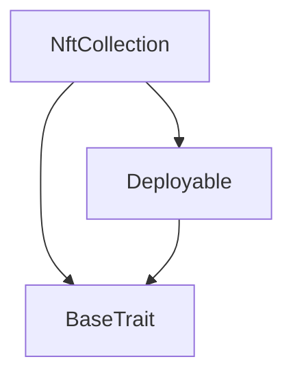
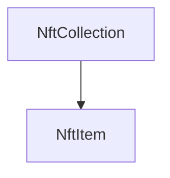

# TACT Compilation Report
Contract: NftCollection
BOC Size: 2081 bytes

# Types
Total Types: 21

## StateInit
TLB: `_ code:^cell data:^cell = StateInit`
Signature: `StateInit{code:^cell,data:^cell}`

## Context
TLB: `_ bounced:bool sender:address value:int257 raw:^slice = Context`
Signature: `Context{bounced:bool,sender:address,value:int257,raw:^slice}`

## SendParameters
TLB: `_ bounce:bool to:address value:int257 mode:int257 body:Maybe ^cell code:Maybe ^cell data:Maybe ^cell = SendParameters`
Signature: `SendParameters{bounce:bool,to:address,value:int257,mode:int257,body:Maybe ^cell,code:Maybe ^cell,data:Maybe ^cell}`

## LogEventMintRecord
TLB: `log_event_mint_record#a3877d65 minter:address item_id:int257 generate_number:int257 = LogEventMintRecord`
Signature: `LogEventMintRecord{minter:address,item_id:int257,generate_number:int257}`

## GetRoyaltyParams
TLB: `get_royalty_params#693d3950 query_id:uint64 = GetRoyaltyParams`
Signature: `GetRoyaltyParams{query_id:uint64}`

## ReportRoyaltyParams
TLB: `report_royalty_params#a8cb00ad query_id:uint64 numerator:uint16 denominator:uint16 destination:address = ReportRoyaltyParams`
Signature: `ReportRoyaltyParams{query_id:uint64,numerator:uint16,denominator:uint16,destination:address}`

## CollectionData
TLB: `_ next_item_index:int257 collection_content:^cell owner_address:address = CollectionData`
Signature: `CollectionData{next_item_index:int257,collection_content:^cell,owner_address:address}`

## RoyaltyParams
TLB: `_ numerator:int257 denominator:int257 destination:address = RoyaltyParams`
Signature: `RoyaltyParams{numerator:int257,denominator:int257,destination:address}`

## Transfer
TLB: `transfer#5fcc3d14 query_id:uint64 new_owner:address response_destination:Maybe address custom_payload:Maybe ^cell forward_amount:coins forward_payload:remainder<slice> = Transfer`
Signature: `Transfer{query_id:uint64,new_owner:address,response_destination:Maybe address,custom_payload:Maybe ^cell,forward_amount:coins,forward_payload:remainder<slice>}`

## OwnershipAssigned
TLB: `ownership_assigned#05138d91 query_id:uint64 prev_owner:address forward_payload:remainder<slice> = OwnershipAssigned`
Signature: `OwnershipAssigned{query_id:uint64,prev_owner:address,forward_payload:remainder<slice>}`

## Excesses
TLB: `excesses#d53276db query_id:uint64 = Excesses`
Signature: `Excesses{query_id:uint64}`

## GetStaticData
TLB: `get_static_data#2fcb26a2 query_id:uint64 = GetStaticData`
Signature: `GetStaticData{query_id:uint64}`

## ReportStaticData
TLB: `report_static_data#8b771735 query_id:uint64 index_id:int257 collection:address = ReportStaticData`
Signature: `ReportStaticData{query_id:uint64,index_id:int257,collection:address}`

## GetNftData
TLB: `_ is_initialized:bool index:int257 collection_address:address owner_address:address individual_content:^cell = GetNftData`
Signature: `GetNftData{is_initialized:bool,index:int257,collection_address:address,owner_address:address,individual_content:^cell}`

## SetAllowedMint
TLB: `set_allowed_mint#d0a2daa4 minter:address allowed:bool = SetAllowedMint`
Signature: `SetAllowedMint{minter:address,allowed:bool}`

## Mint
TLB: `mint#98222a43 recipient:address type:int257 type_index:int257 data:^string = Mint`
Signature: `Mint{recipient:address,type:int257,type_index:int257,data:^string}`

## GetItemType
TLB: `get_item_type#2ce76656 type:int257 type_index:int257 type_data:^string = GetItemType`
Signature: `GetItemType{type:int257,type_index:int257,type_data:^string}`

## SetItemType
TLB: `set_item_type#f58582d4 type:int257 type_index:int257 data:^string = SetItemType`
Signature: `SetItemType{type:int257,type_index:int257,data:^string}`

## Deploy
TLB: `deploy#946a98b6 queryId:uint64 = Deploy`
Signature: `Deploy{queryId:uint64}`

## DeployOk
TLB: `deploy_ok#aff90f57 queryId:uint64 = DeployOk`
Signature: `DeployOk{queryId:uint64}`

## FactoryDeploy
TLB: `factory_deploy#6d0ff13b queryId:uint64 cashback:address = FactoryDeploy`
Signature: `FactoryDeploy{queryId:uint64,cashback:address}`

# Get Methods
Total Get Methods: 5

## get_collection_data

## get_nft_address_by_index
Argument: item_index

## getNftItemInit
Argument: item_index

## get_nft_content
Argument: index
Argument: individual_content

## royalty_params

# Error Codes
2: Stack underflow
3: Stack overflow
4: Integer overflow
5: Integer out of expected range
6: Invalid opcode
7: Type check error
8: Cell overflow
9: Cell underflow
10: Dictionary error
13: Out of gas error
32: Method ID not found
34: Action is invalid or not supported
37: Not enough TON
38: Not enough extra-currencies
128: Null reference exception
129: Invalid serialization prefix
130: Invalid incoming message
131: Constraints error
132: Access denied
133: Contract stopped
134: Invalid argument
135: Code of a contract was not found
136: Invalid address
137: Masterchain support is not enabled for this contract
14534: Not owner
22049: not allowed to mint
27499: initialized tx need from collection
49280: not owner
49469: not from collection
62742: non-sequential NFTs

# Trait Inheritance Diagram

# Contract Dependency Diagram

